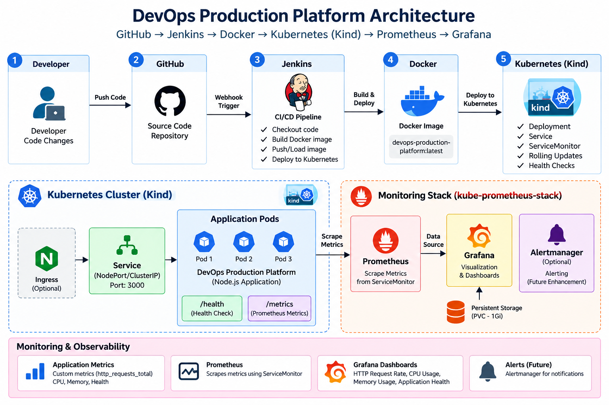

# DevOps Production Platform

A production-style DevOps portfolio project demonstrating an end-to-end application delivery and observability workflow using **GitHub, Jenkins, Docker, Kubernetes, Prometheus, and Grafana**.

The platform is intentionally designed to run locally with **Kind** so the complete CI/CD and monitoring workflow can be demonstrated without maintaining paid cloud infrastructure.

## Architecture



### Delivery flow

```text
Developer
   |
   v
GitHub
   |
   v
Jenkins CI/CD
   |
   +--> Docker Build
   |
   +--> Container Health Check
   |
   +--> Load Image into Kind
   |
   v
Kubernetes / Kind
   |
   +--> Deployment
   +--> Service
   |
   v
Node.js Application
   |
   +--> /health
   +--> /metrics
   |
   v
Prometheus
   |
   v
Grafana
   |
   +--> HTTP Request Rate
   +--> CPU Usage
   +--> Memory Usage
   +--> Application Health
```

## Technology Stack

| Area | Technology |
|---|---|
| Application | Node.js |
| Source Control | Git, GitHub |
| CI/CD | Jenkins |
| Containerization | Docker |
| Container Orchestration | Kubernetes |
| Local Kubernetes | Kind |
| Metrics | Prometheus |
| Visualization | Grafana |
| Application Metrics | `@prometheus-io/client` |
| Scripting | Bash |
| Platform | macOS / Docker Desktop |

## Implemented Features

- Dockerized Node.js application
- Application health endpoint
- Prometheus-compatible application metrics
- Custom `http_requests_total` metric
- Docker image build in Jenkins
- Container-level health validation
- Immutable build-number image tags
- Image loading into a local Kind cluster
- Kubernetes Deployment
- Kubernetes Service
- Rolling deployment verification
- Kubernetes health check from Jenkins
- Prometheus ServiceMonitor
- Prometheus application scraping
- Grafana monitoring dashboard
- CPU, memory, request-rate and application-health panels
- Persistent Grafana storage using a PVC
- Dashboard persistence verified across Grafana pod restart

## CI/CD Pipeline

The Jenkins pipeline performs the following stages:

1. Build the Docker image using the Jenkins build number as the image tag.
2. Run the container locally for validation.
3. Execute the `/health` endpoint health check.
4. Load the image into the `devops-platform` Kind cluster.
5. Update the Kubernetes Deployment to the immutable build image.
6. Wait for the Kubernetes rollout to complete.
7. Verify pods, deployment and service.
8. Port-forward the Kubernetes service and execute another application health check.
9. Clean up the temporary test container.

## Application Endpoints

### Health

```text
GET /health
```

Returns application status and timestamp.

### Metrics

```text
GET /metrics
```

Exposes Prometheus metrics including:

- Node.js process metrics
- Memory metrics
- CPU metrics
- Event-loop metrics
- Custom HTTP request metrics

Example custom metric:

```text
http_requests_total{method="GET",route="/health",status_code="200"} <value>
```

## Kubernetes Monitoring

Prometheus discovers the application through a Kubernetes `ServiceMonitor`.

The monitoring configuration:

- Selects the application Service using its label.
- Scrapes `/metrics`.
- Uses the named `http` Service port.
- Scrapes every 15 seconds.
- Runs in the `monitoring` namespace while monitoring the application in the `default` namespace.

## Grafana Dashboard

The dashboard currently contains four application-focused panels:

### 1. HTTP Request Rate

```promql
sum(rate(http_requests_total{service="devops-production-platform"}[5m]))
```

### 2. Application CPU Usage

```promql
sum by (pod) (rate(process_cpu_seconds_total{service="devops-production-platform"}[5m]))
```

### 3. Application Memory Usage

```promql
sum by (pod) (process_resident_memory_bytes{service="devops-production-platform"})
```

### 4. Application Health

```promql
min(up{job="devops-production-platform"})
```

## Grafana Persistence

Grafana initially used ephemeral storage, which meant manually created dashboards could be lost after a pod restart.

Persistent storage was then enabled with a Kubernetes PVC. The dashboard was recreated and verified after restarting the Grafana Deployment.

This demonstrates an important operational principle:

> Monitoring configuration and dashboards should survive component restarts.

## Project Structure

```text
devops-production-platform/
├── jenkins/
├── k8s/
│   ├── deployment.yaml
│   ├── service.yaml
│   └── ...
├── docs/
│   ├── architecture.png
│   └── screenshots/
├── .dockerignore
├── .gitignore
├── Dockerfile
├── Jenkinsfile
├── index.js
├── package.json
└── package-lock.json
```

## Run Locally

### Prerequisites

Install:

- Docker Desktop
- Git
- kubectl
- Kind
- Jenkins
- Helm

### Clone

```bash
git clone https://github.com/Nithishraj19/devops-production-platform.git
cd devops-production-platform
```

### Create the Kind cluster

```bash
kind create cluster --name devops-platform
```

### Build the application

```bash
npm install
node index.js
```

Application:

```text
http://localhost:3000
```

Health:

```text
http://localhost:3000/health
```

Metrics:

```text
http://localhost:3000/metrics
```

### Build the Docker image

```bash
docker build -t devops-production-platform:local .
```

### Run the container

```bash
docker run --rm -p 3000:3000 devops-production-platform:local
```

### Kubernetes deployment

Apply the Kubernetes manifests:

```bash
kubectl apply -f k8s/
```

Check the deployment:

```bash
kubectl get pods
kubectl get deployment
kubectl get service
```

## Monitoring Stack

The monitoring stack uses the Prometheus community `kube-prometheus-stack` Helm chart.

Grafana can be exposed locally with:

```bash
kubectl port-forward -n monitoring svc/monitoring-grafana 3003:80
```

Then open:

```text
http://localhost:3003
```

Prometheus can be exposed locally with:

```bash
kubectl port-forward -n monitoring svc/monitoring-kube-prometheus-prometheus 9090:9090
```

Then open:

```text
http://localhost:9090
```

## Evidence

The repository should include screenshots showing:

1. Jenkins successful pipeline
2. Kubernetes pods and service
3. Prometheus targets / application metrics
4. Grafana dashboard with the four panels

Place them under:

```text
docs/screenshots/
```

Recommended filenames:

```text
docs/screenshots/jenkins-pipeline.png
docs/screenshots/kubernetes.png
docs/screenshots/prometheus.png
docs/screenshots/grafana-dashboard.png
```

## Current Scope

This project focuses on a complete local production-style workflow.

Cloud infrastructure such as AWS ECR/EKS, Terraform-managed AWS resources, and 24/7 cloud hosting are intentionally not required for the current version. They can be added later as extensions without changing the core application and monitoring design.

## Future Improvements

Possible extensions:

- Kubernetes Horizontal Pod Autoscaler (HPA)
- Alertmanager alerts
- Grafana alerting
- Terraform infrastructure
- AWS ECR image publishing
- AWS EKS deployment
- Blue/green or canary deployment
- Centralized logging
- Security scanning
- Automated rollback
- GitHub/Jenkins status integration

## Portfolio Value

This project demonstrates practical experience with:

- CI/CD pipeline design
- Docker image lifecycle
- Immutable deployments
- Kubernetes deployment and service management
- Health checks and rollout verification
- Prometheus metrics
- Kubernetes service discovery
- Grafana observability
- Persistent monitoring infrastructure
- Troubleshooting deployment and monitoring failures

## Author

**Nithish Raj**

DevOps Engineer / Sr. Software Engineer

GitHub: https://github.com/Nithishraj19
